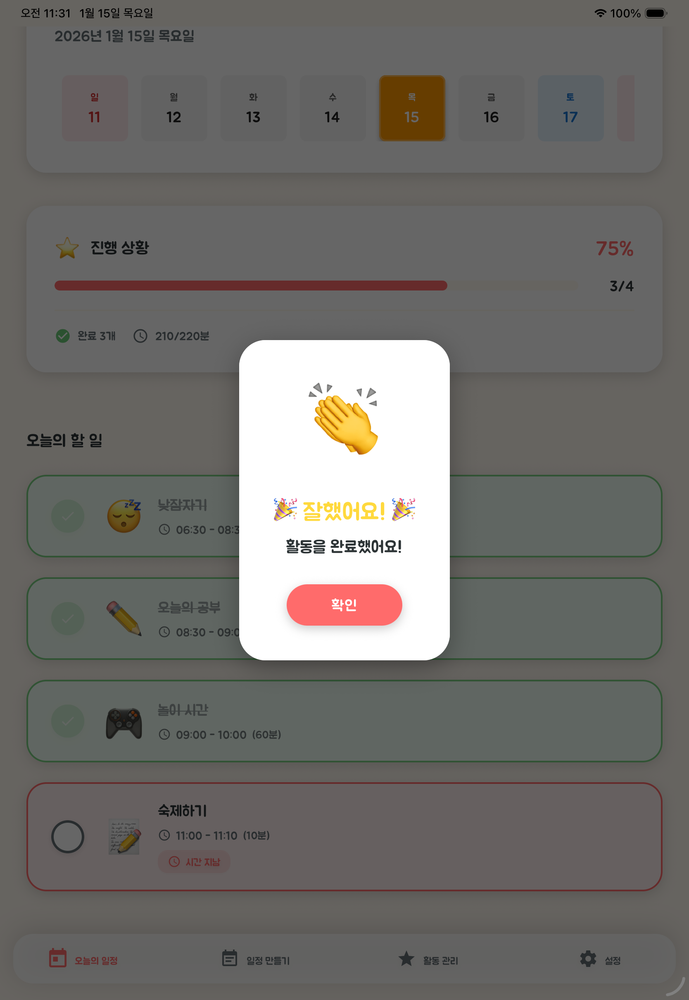
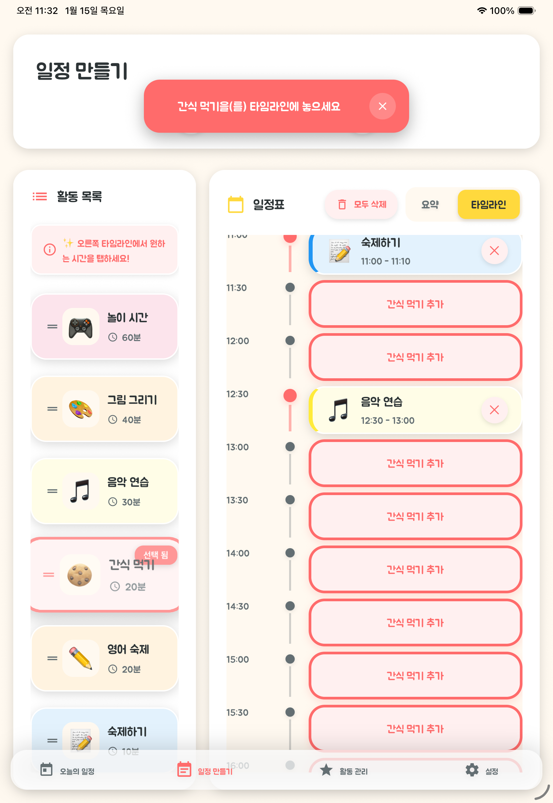
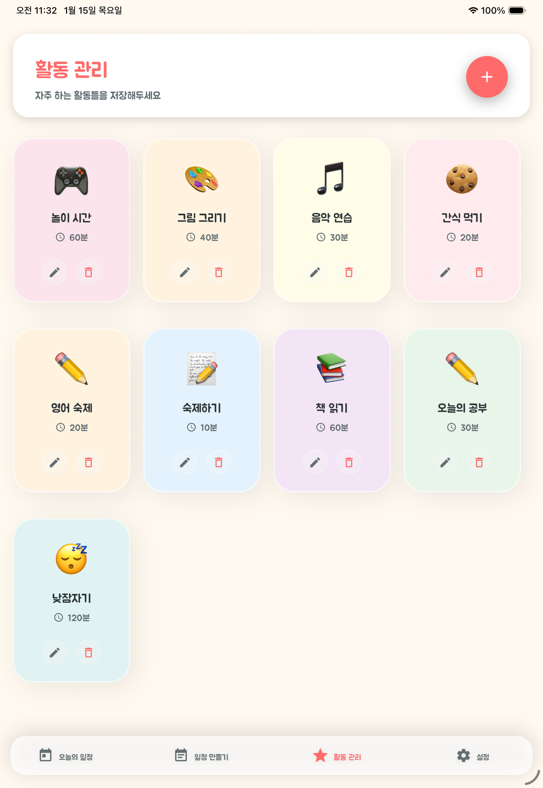
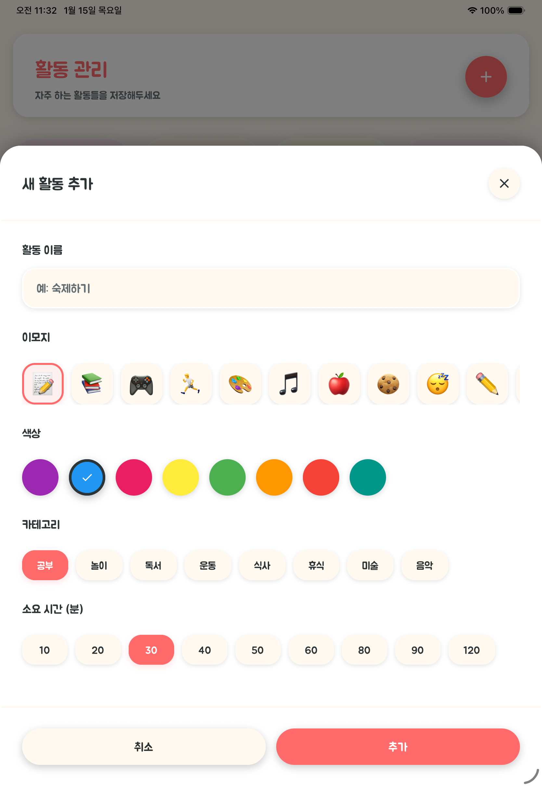
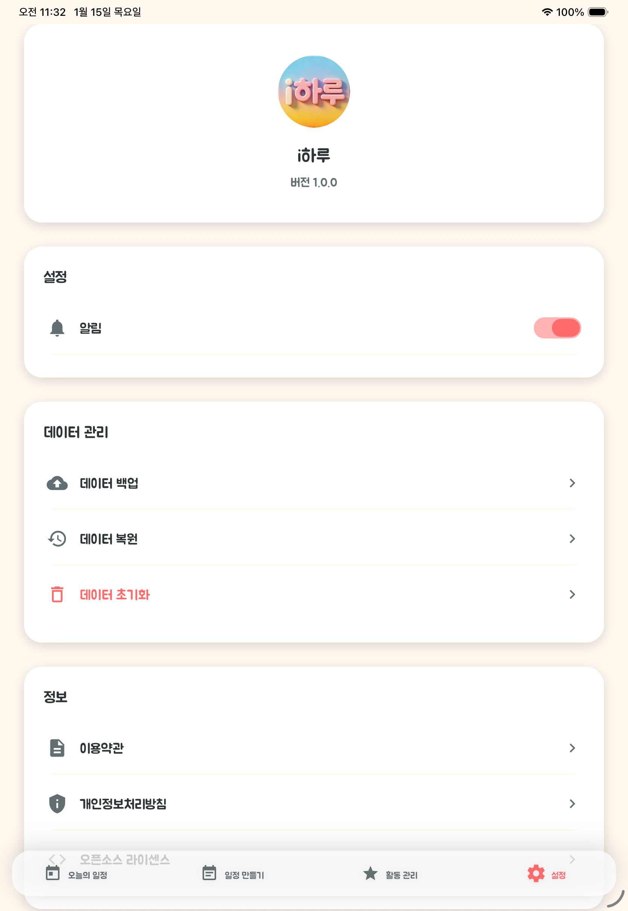

# i하루 (iHaru) 📅

> 아이들이 스스로 하루 일과를 계획하고 관리할 수 있는 태블릿 전용 앱

[](https://opensource.org/licenses/MIT)
[](https://reactnative.dev/)
[](https://expo.dev/)

---

## 🌟 프로젝트 소개

**i하루**는 아이들이 하루 일과를 시각적으로 계획하고, 완료한 일정을 체크하면서 성취감을 느낄 수 있도록 설계된 태블릿 전용 앱입니다.

### 주요 특징

- 📱 **태블릿 전용**: iPad 및 Android 태블릿에 최적화
- 🎨 **직관적인 UI**: 드래그 앤 드롭으로 쉬운 일정 관리
- 🎯 **시각적 타임라인**: 하루 일과를 한눈에 파악
- 🔔 **스마트 알림**: 활동 시작 전 알림으로 시간 관리 지원
- 💾 **로컬 저장**: 모든 데이터는 기기에만 저장 (프라이버시 보호)
- 🌈 **친근한 디자인**: 밝고 따뜻한 색상과 이모지로 아이들에게 친숙

---

## 📱 데모 화면

### 오늘의 일정
일과를 시각적으로 확인하고, 완료한 활동에 대한 축하 메시지를 받을 수 있습니다.



### 일정 만들기
드래그 앤 드롭으로 쉽게 타임라인에 활동을 배치할 수 있습니다.



### 활동 관리
자주 하는 활동을 저장하고 관리할 수 있습니다.



### 활동 추가
새로운 활동을 이모지, 색상, 카테고리로 커스터마이징하여 추가할 수 있습니다.



### 설정
알림 설정, 데이터 백업/복원, 이용약관 등을 확인할 수 있습니다.



---

## ✨ 주요 기능

### 1. 활동 관리
- 자주 하는 활동을 저장하고 재사용
- 이모지와 색상으로 활동 구분
- 활동별 커스텀 설정

### 2. 일정 만들기
- 드래그 앤 드롭으로 타임라인에 일정 배치
- 시간대별 시각적 관리
- 가로/세로 모드 모두 지원

### 3. 오늘의 일정
- 대시보드에서 진행 상황 확인
- 체크리스트로 완료 여부 관리
- 실시간 진행률 표시

### 4. 알림 기능
- 활동 시작 5분 전 알림
- 사용자 설정 가능
- 로컬 알림으로 오프라인에서도 작동

### 5. 데이터 관리
- 데이터 백업/복원
- JSON 형식으로 내보내기
- 기기 간 데이터 이동 지원

---

## 🚀 시작하기

### 필수 요구사항

- Node.js 18 이상
- npm 또는 yarn
- Expo CLI (선택)
- iOS: Xcode (iPad 시뮬레이터용)
- Android: Android Studio (태블릿 에뮬레이터용)

### 설치 및 실행

```bash
# 저장소 클론
git clone https://github.com/Daesung-Kwon/iharu.git
cd iharu

# 의존성 설치
npm install

# 개발 서버 시작
npm start

# iOS 시뮬레이터 실행 (iPad)
npm run ios

# Android 에뮬레이터 실행 (태블릿)
npm run android
```

### 개발 환경 설정

자세한 설정 방법은 [docs/](./docs/) 폴더의 가이드를 참고하세요.

---

## 📁 프로젝트 구조

```
iharu/
├── src/
│   ├── screens/          # 화면 컴포넌트
│   │   ├── TodayScreen.tsx
│   │   ├── PlanScheduleScreen.tsx
│   │   ├── ActivitiesScreen.tsx
│   │   └── ProfileScreen.tsx
│   ├── components/       # 재사용 컴포넌트
│   │   ├── ActivityCard.tsx
│   │   ├── TimelineView.tsx
│   │   └── ...
│   ├── navigation/       # 네비게이션 설정
│   ├── contexts/         # Context API (상태 관리)
│   ├── services/         # 서비스 레이어
│   │   ├── storage.ts
│   │   └── notificationService.ts
│   ├── types/           # TypeScript 타입 정의
│   ├── constants/       # 상수 (색상, 이모지 등)
│   └── utils/           # 유틸리티 함수
├── assets/              # 이미지, 아이콘, 폰트
├── docs/                # 문서
├── app.json             # Expo 설정
└── package.json         # 의존성 관리
```

---

## 🛠️ 기술 스택

- **프레임워크**: React Native 0.81.5
- **플랫폼**: Expo SDK 54
- **언어**: TypeScript
- **상태 관리**: React Context API
- **네비게이션**: React Navigation
- **스타일링**: React Native StyleSheet
- **애니메이션**: React Native Reanimated, Lottie

---

## 📱 플랫폼 지원

- ✅ **iOS**: iPad (모든 세대)
- ✅ **Android**: 태블릿 (7인치 이상)
- ❌ **스마트폰**: 지원하지 않음 (태블릿 전용)

---

## 🤝 기여하기

**i하루**는 오픈소스 프로젝트입니다! 여러분의 기여를 환영합니다.

### 기여 방법

1. **Fork** 이 저장소
2. **Feature 브랜치** 생성 (`git checkout -b feature/AmazingFeature`)
3. **커밋** (`git commit -m 'Add some AmazingFeature'`)
4. **Push** (`git push origin feature/AmazingFeature`)
5. **Pull Request** 열기

자세한 기여 가이드는 [CONTRIBUTING.md](./CONTRIBUTING.md)를 참고하세요.

### 기여할 수 있는 영역

- 🐛 **버그 수정**: 이슈를 확인하고 수정
- ✨ **새 기능**: 아이디어 제안 및 구현
- 📝 **문서화**: 문서 개선 및 번역
- 🎨 **디자인**: UI/UX 개선
- 🧪 **테스트**: 테스트 코드 작성
- 🌍 **다국어**: 다른 언어 지원 추가

---

## 📄 라이센스

이 프로젝트는 MIT 라이센스를 따릅니다. 자세한 내용은 [LICENSE](./LICENSE) 파일을 참고하세요.

---

## 🙏 감사의 말

이 프로젝트는 다음 오픈소스 프로젝트들을 사용합니다:

- [React Native](https://reactnative.dev/)
- [Expo](https://expo.dev/)
- [React Navigation](https://reactnavigation.org/)
- [date-fns](https://date-fns.org/)
- [Lottie](https://airbnb.io/lottie/)

폰트:
- [BMJUA (배달의민족 주아체)](https://www.woowahan.com/#/fonts) - SIL Open Font License 1.1

전체 오픈소스 라이센스 목록은 앱 내 "오픈소스 라이센스" 메뉴에서 확인할 수 있습니다.

---

## 📞 연락처

- **이슈 리포트**: [GitHub Issues](https://github.com/Daesung-Kwon/iharu/issues)
- **기능 제안**: [GitHub Discussions](https://github.com/Daesung-Kwon/iharu/discussions)

---

## 🗺️ 로드맵

- [ ] 다국어 지원 (영어, 일본어 등)
- [ ] 클라우드 동기화 기능
- [ ] 부모-자녀 계정 연동
- [ ] 통계 및 리포트 기능
- [ ] 커스텀 테마 지원
- [ ] 음성 알림 기능

---

## ⭐ Star History

이 프로젝트가 도움이 되셨다면 ⭐를 눌러주세요!

---

**Made with ❤️ for children and families**
